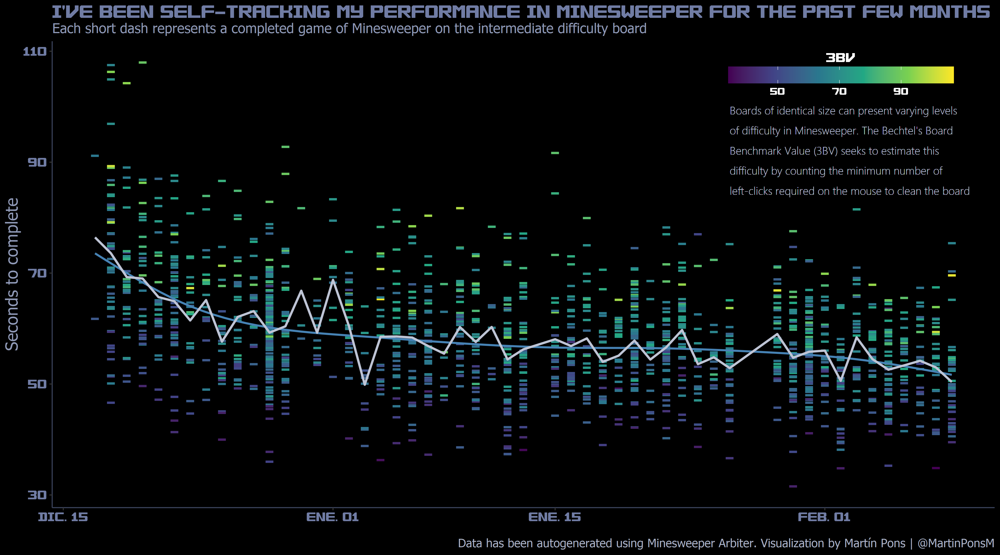

# ANALYSIS OF AUTOGENERATED MINESWEEPER DATA

This repository serves as a ... of different analysis done with autogenerated data from playing the game Minesweeper, using the clone *Arbiter* which offers all kinds of usefull statistics like time to complete the board and well known difficulty and performance measures among gamers like [3BV](https://www.minesweeper.info/wiki/3BV) and 3BVs.

You can download the arbiter clone [here](https://minesweepergame.com/download/arbiter.php). It requires no installation.

The first analyis performed consists in self-tracking my daily minewseeper performance. This visualizations illustrates the average time to complete an intermediate board along a few months

